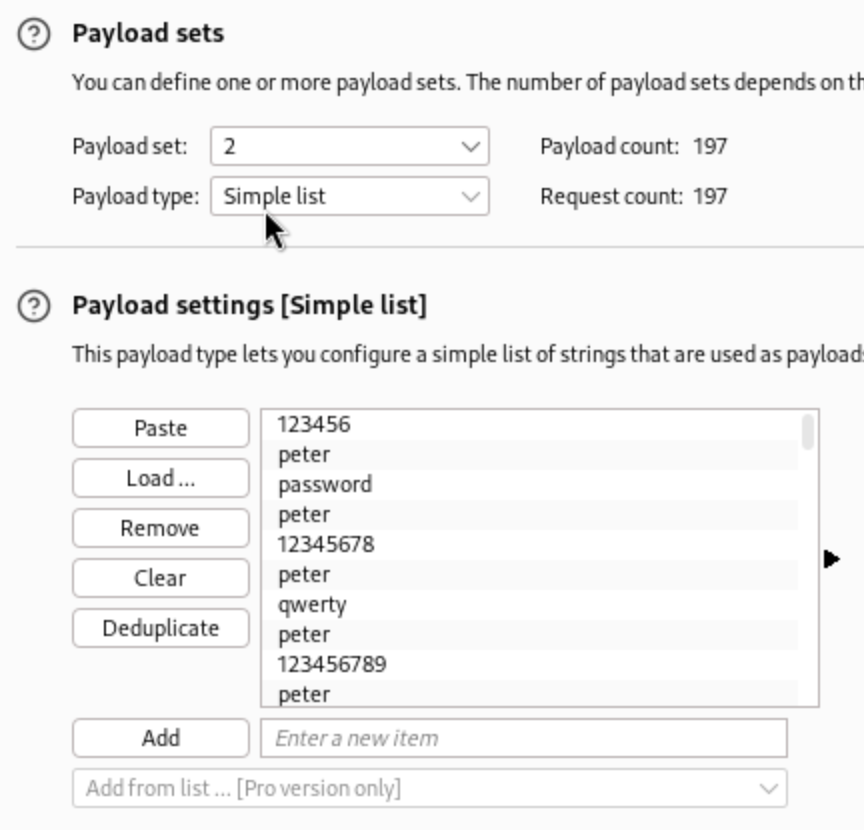
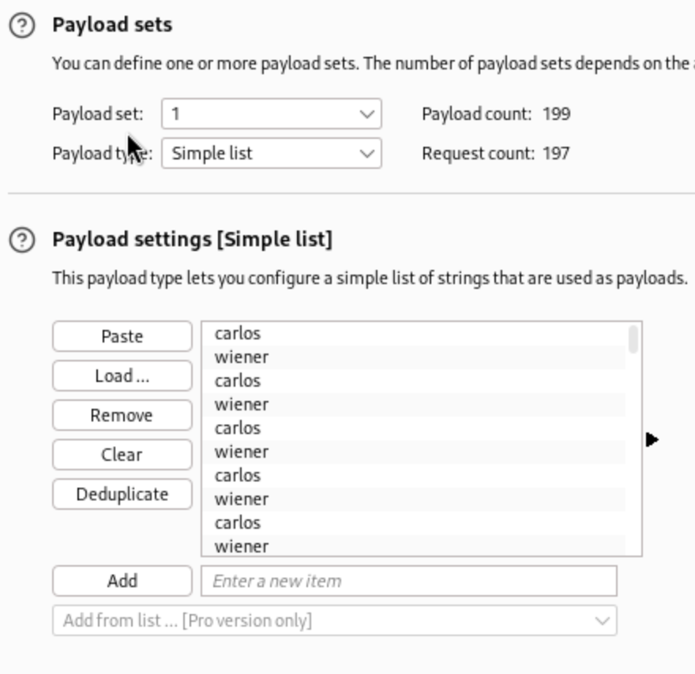
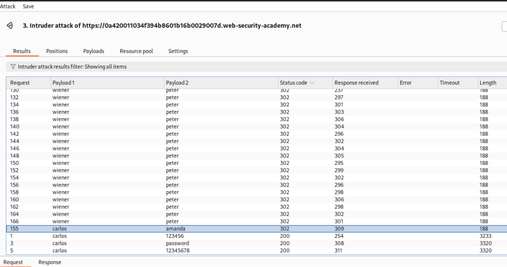
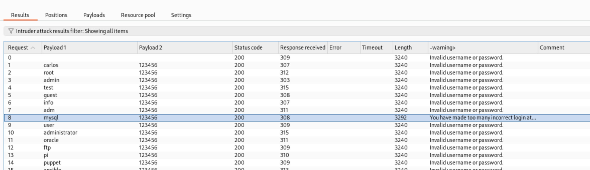
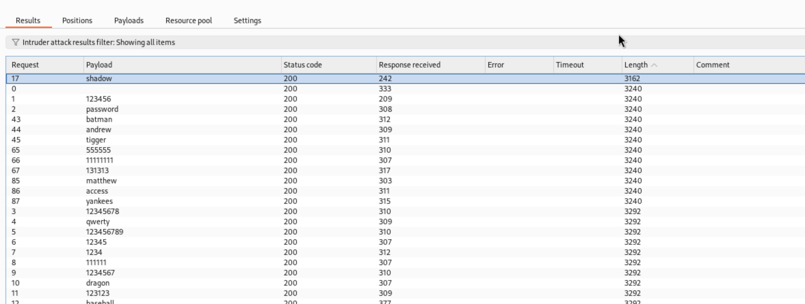

# Lab: Username enumeration via different responses

## Lab's description

This lab is vulnerable to username enumeration and password brute-force attacks. It has an account with a predictable username and password, which can be found in the following wordlists

[Authentication lab usernames](https://portswigger.net/web-security/authentication/auth-lab-usernames)

[Authentication lab passwords](https://portswigger.net/web-security/authentication/auth-lab-passwords)

**End goal:** enumerate a valid username, brute-force this user's password, then access their account page

## Solution

We use `Burp Suite` to interrupt the page and send it to `intruder`.

we have username list and password list, use them for payload.

First try to input anything in username and password field to see what happen. We see it responses `invalid username`. So we have clue, find username which is valid.

Add `§` to username's input

We can see the different length between them

Now we need to find the correct password for `ads`, add `§` for password's input

**Reference:** [Lab: Username enumeration via different responses](https://portswigger.net/web-security/learning-paths/authentication-vulnerabilities/password-based-vulnerabilities/authentication/password-based/lab-username-enumeration-via-different-responses#)

# Lab: Username enumeration via subtly different responses

## Lab's description

This lab is subtly vulnerable to username enumeration and password brute-force attacks. It has an account with a predictable username and password, which can be found in the following wordlists:

[Authentication lab usernames](https://portswigger.net/web-security/authentication/auth-lab-usernames)

[Authentication lab passwords](https://portswigger.net/web-security/authentication/auth-lab-passwords)

**End goal:** enumerate a valid username, brute-force this user's password, then access their account page.

## Solution

It same as lab above, but the respond is `Invalid username or password.`

We go to `Settings`, scroll down to `Grep-Extract`, add:

This username responses same error but without `.`

After having username, we do searching password same as above.

**Reference:** [Lab: Username enumeration via subtly different responses](https://portswigger.net/web-security/learning-paths/authentication-vulnerabilities/password-based-vulnerabilities/authentication/password-based/lab-username-enumeration-via-subtly-different-responses)

# Lab: Username enumeration via response timing

## Lab's description

This lab is vulnerable to username enumeration using its response times. To solve the lab, enumerate a valid username, brute-force this user's password, then access their account page.

**End goal:** enumerate a valid username, brute-force this user's password, then access their account page.

## Solution

First, input any username and a long password (longer 100 characters)

In this lab, if we try so many time, it will response `Try many time. Please try again after 30 minutes`. So to bypass this, we need to add `X-Forwarded-For: [numb]` with [numb] from range 1 to 100 to change to different IP.

We will see the username with the `Response received` time different.

**Reference:** [Lab: Username enumeration via response timing](https://portswigger.net/web-security/learning-paths/authentication-vulnerabilities/password-based-vulnerabilities/authentication/password-based/lab-username-enumeration-via-response-timing)

# Lab: Broken brute-force protection, IP block

## Lab's description

This lab is vulnerable due to a logic flaw in its password brute-force protection.

Your credentials: wiener:peter
Victim's username: carlos

**End goal:** brute-force the victim's password, then log in and access their account page.

## Solution

In this lab, the counter for the number of failed attempts resets if the IP owner logs in successfull.

So to avoid IP blocking, we should interleave our username and victim's username and so on for the password.

**Reference:** [Lab: Broken brute-force protection, IP block](https://portswigger.net/web-security/learning-paths/authentication-vulnerabilities/password-based-vulnerabilities/authentication/password-based/lab-broken-bruteforce-protection-ip-block#)

# Lab: Username enumeration via account lock

## Solution

Set `Attack type` to `Cluster bomb`. First payload for username is a list of username, then second payload is `null` and generate it 5 times.

`username=§abc§&password=abc§§`

After attacking, we will see one of them have the different in lengthy. Because it responses `You have made too many incorrect login attempts.`

Now take that username, set `Attack type` to `Sniper` and add the list of passwords to the payload, set grep extract for error message.

**Reference:** [Lab: Username enumeration via account lock](https://portswigger.net/web-security/learning-paths/authentication-vulnerabilities/password-based-vulnerabilities/authentication/password-based/lab-username-enumeration-via-account-lock)

