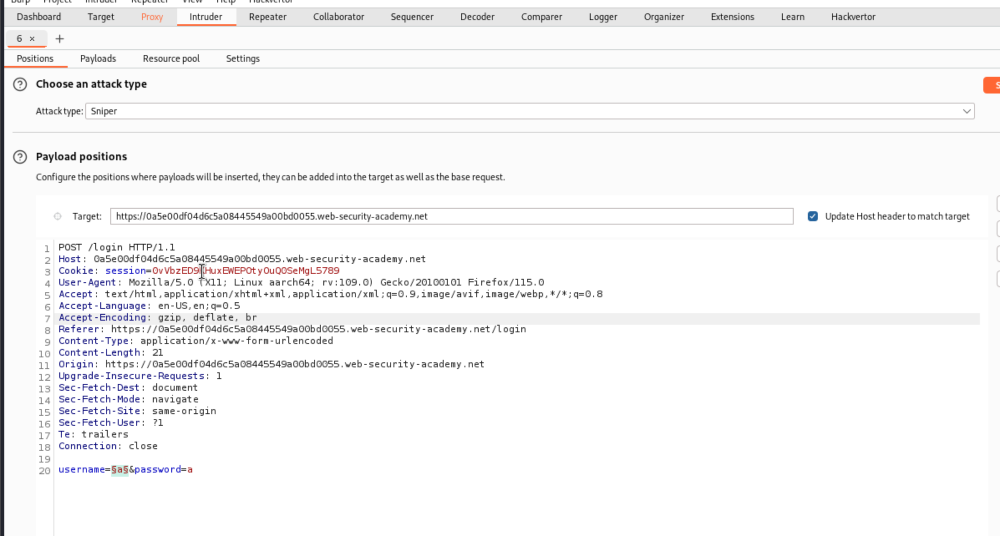
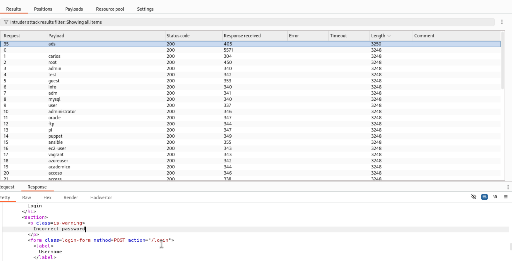
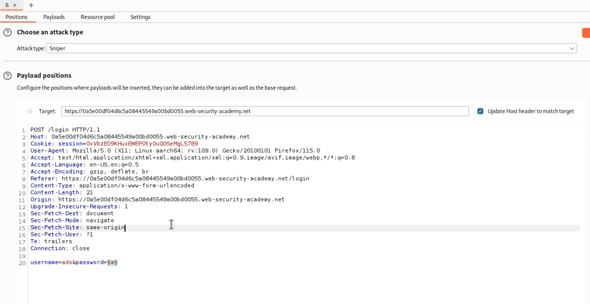
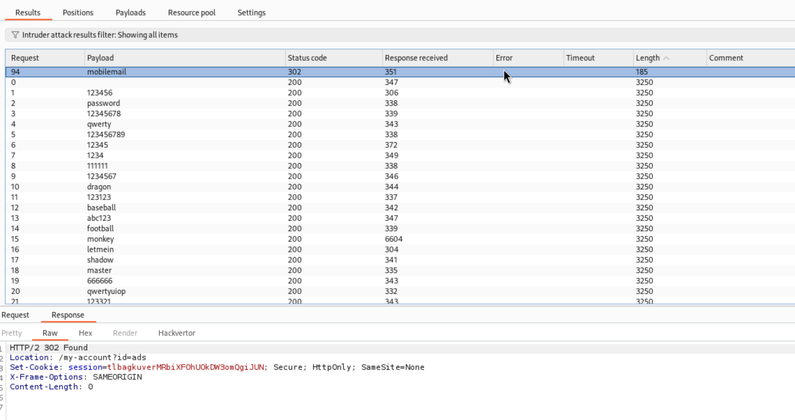
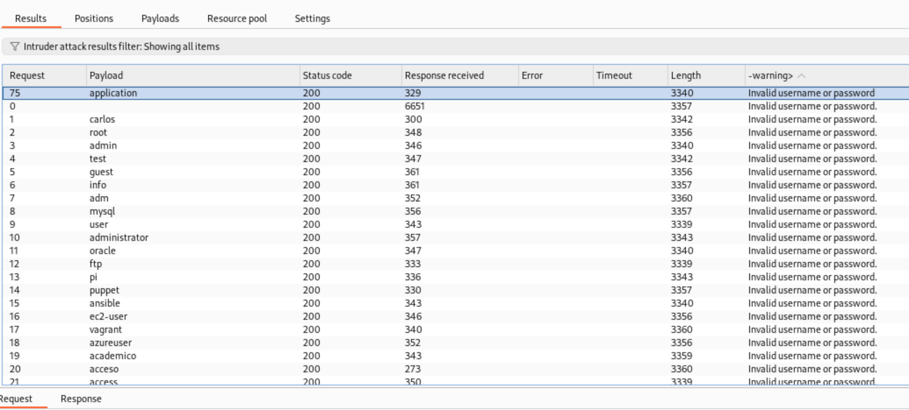
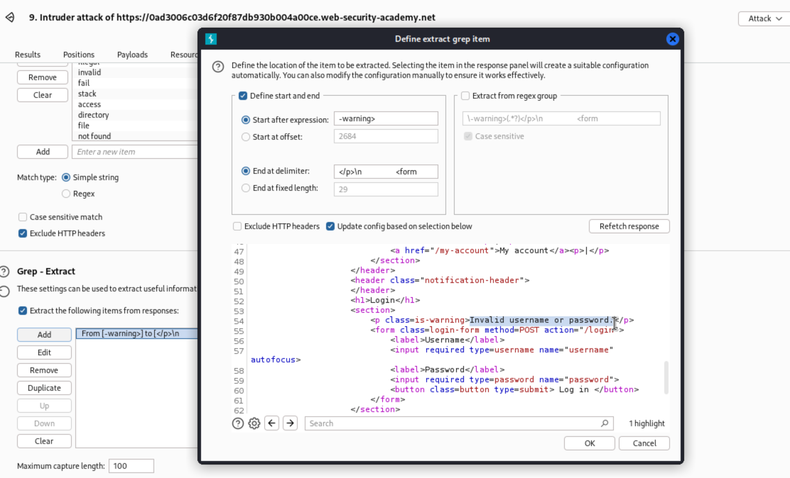
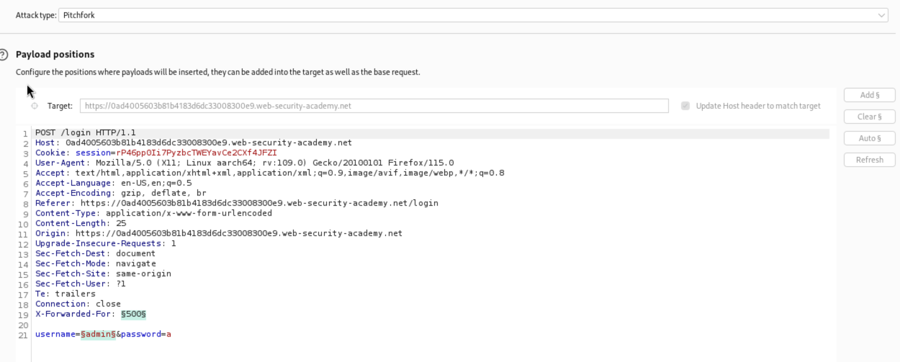
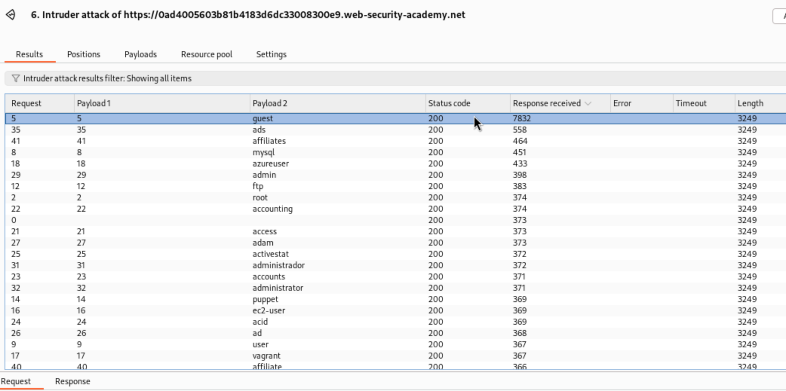

# Lab: Username enumeration via different responses

## Lab's description

This lab is vulnerable to username enumeration and password brute-force attacks. It has an account with a predictable username and password, which can be found in the following wordlists

[Authentication lab usernames](https://portswigger.net/web-security/authentication/auth-lab-usernames)
[Authentication lab passwords](https://portswigger.net/web-security/authentication/auth-lab-passwords)

**End goal:** enumerate a valid username, brute-force this user's password, then access their account page

## Solution

We use `Burp Suite` to interrupt the page and send it to `intruder`.

we have username list and password list, use them for payload.

First try to input anything in username and password field to see what happen. We see it responses `invalid username`. So we have clue, find username which is valid.

Add `§` to username's input

We can see the different length between them

Now we need to find the correct password for `ads`, add `§` for password's input

**Reference:** [Lab: Username enumeration via different responses](https://portswigger.net/web-security/learning-paths/authentication-vulnerabilities/password-based-vulnerabilities/authentication/password-based/lab-username-enumeration-via-different-responses#)

# Lab: Username enumeration via subtly different responses

## Lab's description

This lab is subtly vulnerable to username enumeration and password brute-force attacks. It has an account with a predictable username and password, which can be found in the following wordlists:

[Authentication lab usernames](https://portswigger.net/web-security/authentication/auth-lab-usernames)
[Authentication lab passwords](https://portswigger.net/web-security/authentication/auth-lab-passwords)

**End goal:** enumerate a valid username, brute-force this user's password, then access their account page.

## Solution

It same as lab above, but the respond is `Invalid username or password.`

We go to `Settings`, scroll down to `Grep-Extract`, add:

This username responses same error but without `.`

After having username, we do searching password same as above.

**Reference:** [Lab: Username enumeration via subtly different responses](https://portswigger.net/web-security/learning-paths/authentication-vulnerabilities/password-based-vulnerabilities/authentication/password-based/lab-username-enumeration-via-subtly-different-responses)

# Lab: Username enumeration via response timing

## Lab's description

This lab is vulnerable to username enumeration using its response times. To solve the lab, enumerate a valid username, brute-force this user's password, then access their account page.

**End goal:** enumerate a valid username, brute-force this user's password, then access their account page.

## Solution

First, input any username and a long password (longer 100 characters)

We will see the username with the `Response received` time different.

**Reference:** [Lab: Username enumeration via response timing](https://portswigger.net/web-security/learning-paths/authentication-vulnerabilities/password-based-vulnerabilities/authentication/password-based/lab-username-enumeration-via-response-timing)

