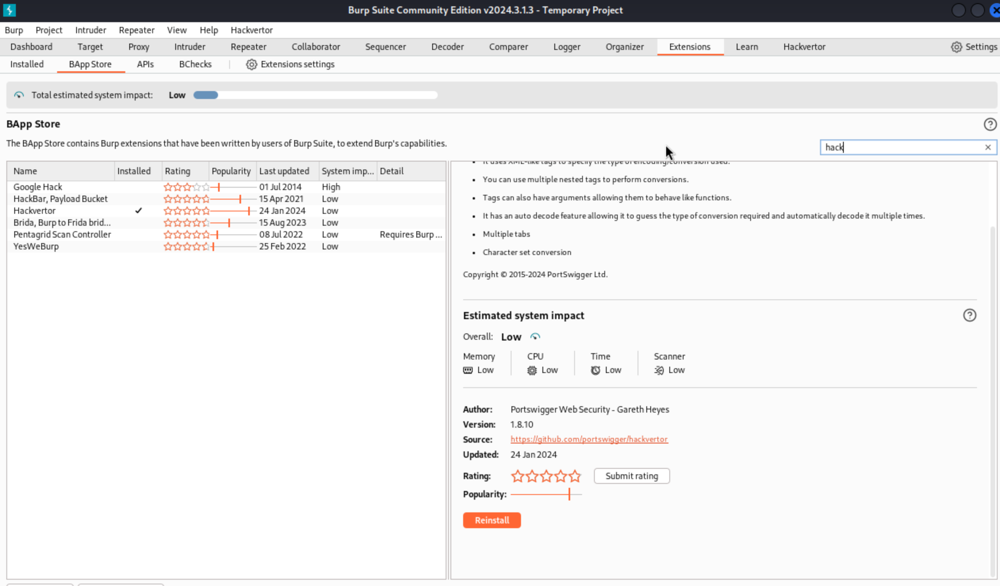
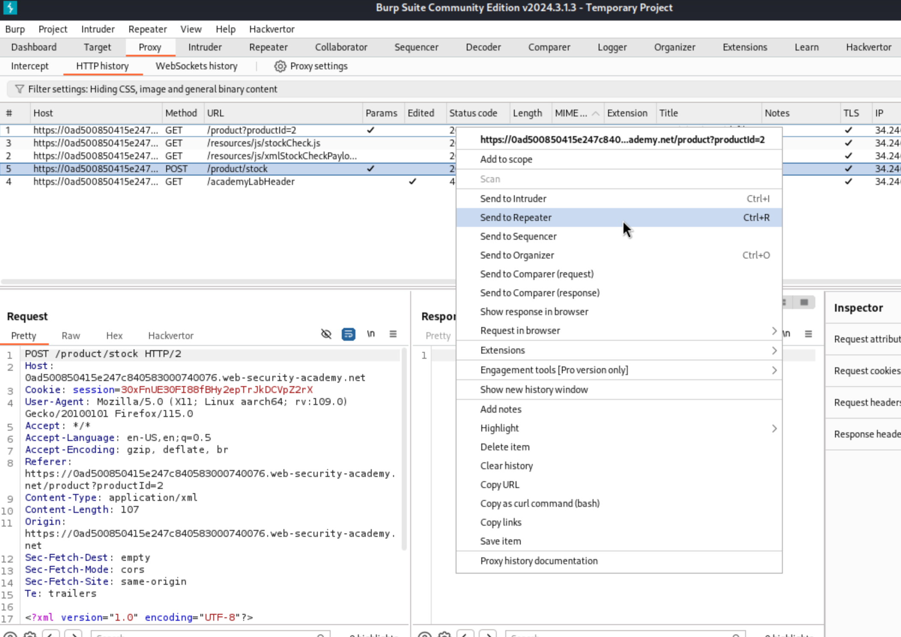
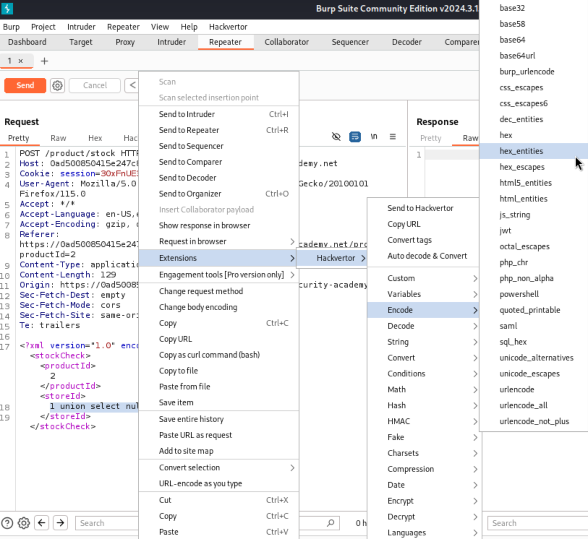

# Lab: SQL injection with filter bypass via XML encoding

## Lab's description

This lab contains a SQL injection vulnerability in its stock check feature. The results from the query are returned in the application's response, so you can use a UNION attack to retrieve data from other tables.

**End goal:** perform a SQL injection attack to retrieve the admin user's credentials, then log in to their account.

## Solution

To complete this lab, we need to install `Hackvertor` extension. Step to set up:

Go to any blog, click `Check stock` at the bottom of blog. We will see it responses the unit of product, then send the `POST` to `Repeater`.

Then modify `<storeID>`: `1 union select null`. We will receive `Attack detected` response.

We need to add `Encode tag` from `Hackvertor` extension

After that, we modify `<storeID>`: `1 union select username || '`' || password from users`

We will receive the password of `administrator`.

**Reference:** [Lab: SQL injection with filter bypass via XML encoding](https://portswigger.net/web-security/learning-paths/sql-injection/sql-injection-in-different-contexts/sql-injection/lab-sql-injection-with-filter-bypass-via-xml-encoding)
